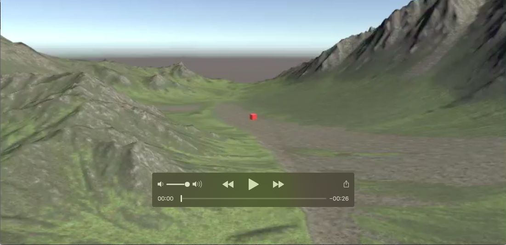
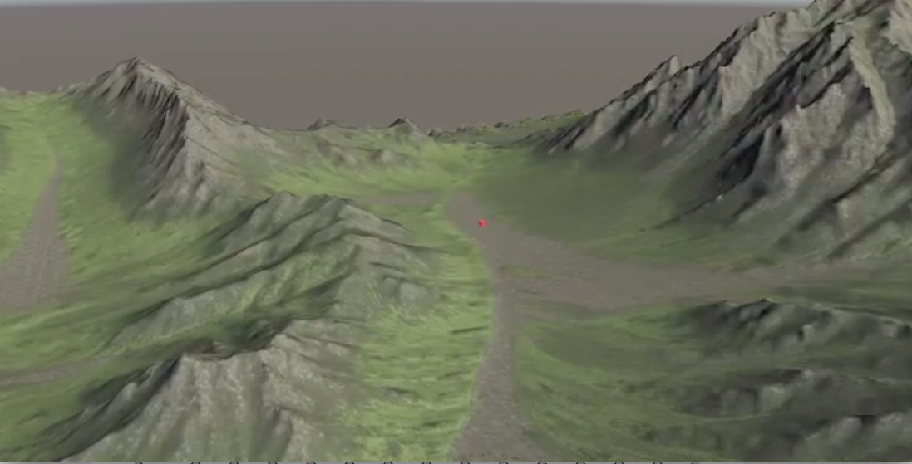
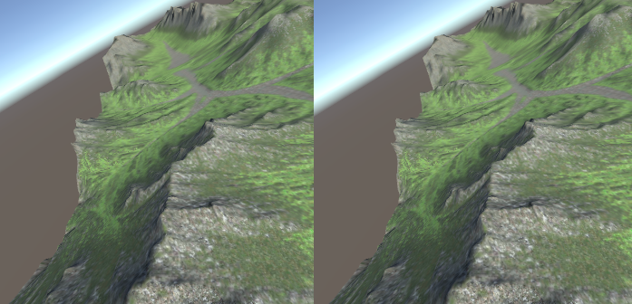
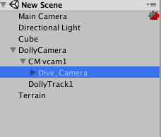

## About Cinemachine of Unity  
With Cinemachine you can make it a camera work like a movie.  

The created video is here!  
<https://github.com/YatLok/Unity_Cinemachine/blob/master/Recordings/movie.mp4>  

1. Download Cinemacine from AssetStore.  
2. If you select Create Dolly Camera with Track from Chinemachine in the menu, CM vcam1 and DollyTrack 1 are displayed in Hierarchy.  
3. Attach the object you want to follow in the camera to Fallow and Look At part of CM vcam1.  
4. In DollyTrack 1, create a rail to move the camera. The creation of rails can be created arbitrarily in the Waypoints part.  
5. Move the numerical value of Path Position in CMvcam 1's Body so that the camera can run along the rail.  

  
  
  

With Timeline, you can create movie-like motion with running and stopping the camera at arbitrary speed.  
You can also use Dive_Camera if you want to watch videos with VR camera.  
  
Dive_Camera has been downloaded here.  
<https://www.durovis.com/en/sdk.html>  

## UnityのCinemachineについて  
Cinemachineを使用すると、映画のようなカメラワークにすることができます。  

作成した動画はこちらです！  
<https://github.com/YatLok/Unity_Cinemachine/blob/master/Recordings/movie.mp4>  
  
1. AssetStoreから、Cinemacineをダウンロードします。  
2. メニューのChinemachineから、Create Dolly Camera with Trackを選択すると、HierarchyにCM vcam1とDollyTrack1が表示されます。  
3. CM vcam1の Fallow とLook At部分に、カメラでフォローしたいオブジェクトをアタッチします。  
4. DollyTrack１では、カメラを移動させるレールを作成します。レールの作成は、Waypoints部分で任意に作成可能です。  
5. CMvcam1のBody内のPath Positionの数値を動かすと、カメラをレールに沿って走らせることができます。  

  
  
  

Timelineを使用すると、カメラを任意の速度で走らせたり、停止させたりと、映画のような動きを作成することができます。  
また、VR用のカメラで映像をみたい場合は、Dive_Cameraを使用できます。  
  
Dive_Cameraは<https://www.durovis.com/en/sdk.html>こちらでダウンロードしました。  
